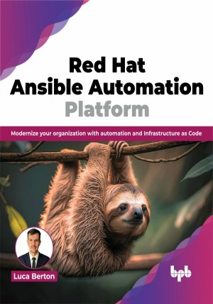

# Red Hat Ansible Automation Platform

Get enterprise framework for building and operating IT automation at scale, from networking to operations

This is the repository for [Red Hat Ansible Automation Platform
](https://bpbonline.com/products/red-hat-ansible-automation-platform?variant=43103380046024),published by BPB Publications.

## About the Book
This book equips you to revolutionize operations across Cloud Infrastructure, Applications, Networks, Containers, and Security. From foundational concepts to advanced strategies, the readers will navigate Ansible Automation intricacies, covering architecture, syntax, and installation scenarios, including single-machine setups and high-availability clusters. Authentication mastery encompasses Role-Based Access Controls (RBAC) and external authentication, ensuring a secure user management foundation.

System administration intricacies, such as metrics, logging, performance monitoring, and backup strategies, are explored, providing readers with holistic insights. Application deployment takes center stage in this book, emphasizing creating Ansible playbooks and content, automating deployment processes, and managing container applications. The book explores hybrid cloud environments, integrating Ansible with Kubernetes to manage applications across major cloud providers.

The concluding chapter encapsulates key learnings, offering a reflective mastery of the Ansible Automation Platform. This guide provides practical skills for designing, deploying, and orchestrating end-to-end automation. 

## What You Will Learn
• Automate security patching for enhanced system uptime and resilience.

• Orchestrate multi-cloud deployments with unified playbooks for consistent and efficient control.

• Apply RBAC for secure collaboration and auditable workflows.

• Integrate metrics and logs for actionable insights and optimized automation workflows.

• Implement granular user roles and permissions for access control and team collaboration.
